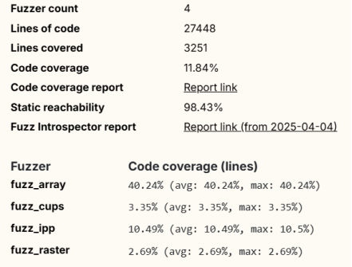
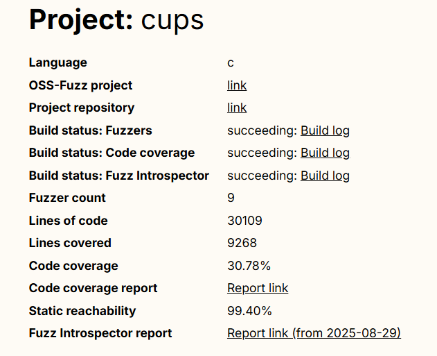
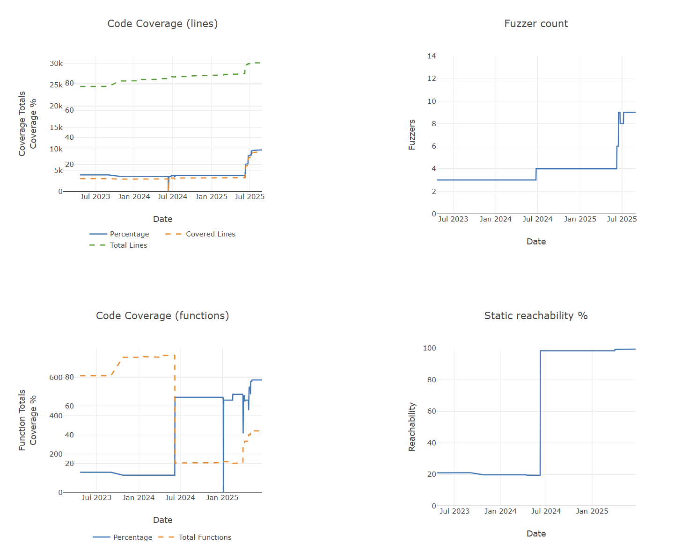
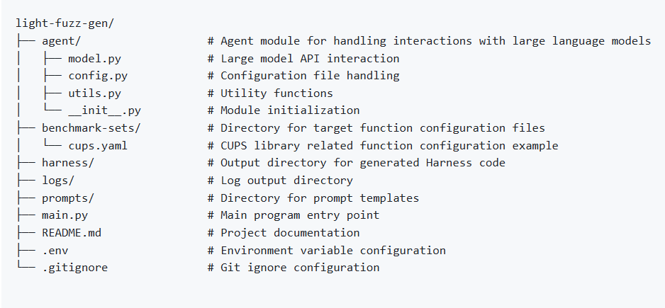

# Utilizing OSS-Fuzz-Gen to Improve Fuzz Testing for OpenPrinting Projects

- **Year:** 2025
- **Contributor:** Zixuan Liu

- **Organization**: OpenPrinting, The Linux Foundation

- **Mentors**: Till Kamppeter, Jiongchi Yu, George-Andrei Iosif

- **Useful Links**:
  - [Project Page](https://summerofcode.withgoogle.com/programs/2025/projects/gRbcUkWB)
  - [Source Code for Fuzz Harnesses](https://github.com/OpenPrinting/fuzzing)
  - OSS-Fuzz Projects
    - [cups](https://github.com/google/oss-fuzz/tree/master/projects/cups)
    - [libcups](https://github.com/google/oss-fuzz/tree/master/projects/libcups)
    - [cups-filters](https://github.com/google/oss-fuzz/tree/master/projects/cups-filters)
  - [OSS-Fuzz-Gen](https://github.com/google/oss-fuzz-gen/tree/main) and [Light-Fuzz-Gen](https://github.com/pushinl/light-fuzz-gen)

## Project Detail

This project aims to improve fuzz testing for OpenPrinting’s C/C++ codebases by leveraging OSS-Fuzz-Gen, a new framework that uses Large Language Models (LLMs) to assist fuzz testing. While some OpenPrinting projects are already integrated into Google’s OSS-Fuzz, current fuzzing efforts achieve limited runtime coverage (e.g., only 11.84% for cups), leaving many functions untested. To address this, the project will (1) refine existing fuzzers, (2) improve corpus and dictionary quality using LLMs, and (3) generate additional fuzz harnesses with OSS-Fuzz-Gen to improve the coverage. This will enhance test depth, uncover hidden vulnerabilities, and strengthen the security of OpenPrinting projects.

However, during practice I identified some major limitations of OSS-Fuzz-Gen. The biggest flaw is that when a YAML defines multiple functions, OSS-Fuzz-Gen creates a separate fuzzer for each function. This makes it hard to capture the relationships of functions called —— which limits coverage. Besides, OSS-Fuzz-Gen is highly encapsulated and heavy. Even minor issues like network instability can cause the entire pipeline to fail. To address these issues, I proposed Light-Fuzz-Gen (https://github.com/pushinl/light-fuzz-gen), with the aim of eventually integrating it back into OSS-Fuzz-Gen. This approach allowed me to generate a large number of harnesses and seeds, which significantly improved the code coverage of the OpenPrinting project. 

## Achievement

- **Light-Fuzz-Gen.** I proposed Light-Fuzz-Gen, a lightweight tool that utilizes large language models such as GPT-4o, Gemini-2.5-Pro, etc. to automatically generate fuzz test harness code. This tool consists of two modules, **code analysis-YAML generation module** and **harness code generation module**. Harness code generation module can automatically generate harness code suitable for fuzz testing by providing target function signatures, parameter types, and return types. Moreover, due to the fact that the harness generation of OSS-Fuzz-Gen is also based on YAML configuration files containing information about the entry functions to be tested, the creation of these configuration files often requires sufficient understanding of the target project, which hinders the rapid integration of fuzz testing for new projects. So I added code analysis-YAML generation module, a workflow that can automatically analyze the source code of the target project and generate a certain number of YAML configuration files. It automatically understands the source code of the target project and generates possible YAML files through multiple steps such as parsing function symbols, batch inputting LLM for analysis, summarizing output, and post-processing. At least 20 YAML configuration files have been generated through this module, and 4 are actually used to generate harness code. Although designed for Light-Fuzz-Gen, it can be used for OSS-Fuzz-Gen after post-processing.

- **Tested over 10 harnesses and finally added 6 that achieved good results.** This means that I have increased the coverage of cups from 11% to 30%, libcups from 14% to 17%, and discovering **15 new issues** through OSS-Fuzz. The details are as follows:
  - Fixed the `Makefile` to support OSS-Fuzz-Gen.
  - Added fuzzers: `fuzz_ipp_gen`, `fuzz_ppd_gen`, `fuzz_ppd_gen_cache `, `fuzz_ppd_gen_conflicts`, `fuzz_http_core`, and so on.
  - For each fuzzer, unique seeds and corpora are involved.
  - Fixed most of the memory leaks in existing fuzzers.

- **Create 8 PRs:**

  [Support oss-fuzz-gen harnesses by avoiding nested directories by pushinl · Pull Request #9 · OpenPrinting/fuzzing](https://github.com/OpenPrinting/fuzzing/pull/9)

  [fix most of the memory leaks in fuzz_ppd && add fuzz_ipp_gen by pushinl · Pull Request #19 · OpenPrinting/fuzzing](https://github.com/OpenPrinting/fuzzing/pull/19)

  [add fuzz ppd gen 1 by pushinl · Pull Request #20 · OpenPrinting/fuzzing](https://github.com/OpenPrinting/fuzzing/pull/20)

  [add some new ppd fuzzers by pushinl · Pull Request #21 · OpenPrinting/fuzzing](https://github.com/OpenPrinting/fuzzing/pull/21)

  [fix fuzz_ppd_cache, del fuzz_ppd_options by pushinl · Pull Request #23 · OpenPrinting/fuzzing](https://github.com/OpenPrinting/fuzzing/pull/23)

  [add http related fuzzer and corpus by pushinl · Pull Request #24 · OpenPrinting/fuzzing](https://github.com/OpenPrinting/fuzzing/pull/24)

  [add libcups fuzzer && Makefile by pushinl · Pull Request #25 · OpenPrinting/fuzzing](https://github.com/OpenPrinting/fuzzing/pull/25)

  [add seeds for cups-filters and update Makefile by pushinl · Pull Request #39 · OpenPrinting/fuzzing](https://github.com/OpenPrinting/fuzzing/pull/39)

- **Coverage details e.g.:**

  before:

  

  after:

  

  

## About OSS-Fuzz-Gen and LLM-driven harness generation

During the process of using OSS-Fuzz-Gen to generate harness for cups, I found that OSS-Fuzz-Gen has many limitations:

- **One fuzzer per function — no call relationships**
  When a YAML defines multiple functions, OSS-Fuzz-Gen creates separate fuzzer for each function. This makes it hard to capture the relationships of functions call —— which limits coverage. For a module that requires fuzz testing, they may use some structured parameters depending on some of the more important functions. For example, ppdOpenFile is an important function that needs to be used, but the old method cannot input prompts about it into LLM when fuzzing related entry functions. 
- **Heavy and encapsulation** 
  OSS-Fuzz-Gen is highly encapsulated and heavy. Even minor issues like network instability can cause the entire pipeline to fail.

The coverage of harness generated by OSS-Fuzz-Gen vs human-written  harness:

So I tried to develop Light-Fuzz-Gen to generate harnesses with multi-function based on OSS-Fuzz-Gen. I optimized YAML configuration file, and designed a system which can analyze multiple functions in the configuration file, understand the relationships between them, and generate harness code that can reasonably call these functions. That's my initial optimization idea for LLM-driven harness generation.

> However, there is currently no relevant issue mentioning this point. I will probably try to summarize my viewpoint and raise an issue. And Light-Fuzz-Gen cannot replace OSS-Fuzz-Gen. What I propose is a lightweight tool that cannot fully automate the entire process of harness generation, compilation, and testing, and requires human-in-loop.

The initial architectural diagram of Light-Fuzz-Gen:

## Challenge

OSS-Fuzz-Gen can attempt to automatically fix compilation issues with generated harnesses by inputting compilation errors, harness, and more information back into LLM. However, when experiencing OSS-Fuzz-Gen, I felt that its effectiveness was relatively small. Light-Fuzz-Gen does not have an integrated compilation process, so it cannot be added this feature. The compilation of C/C++programs is relatively complex, and perhaps human in loop is still indispensable.

Light-Fuzz-Gen also has many limitations need to resolve, such as:

- The context compression method for understanding source code and workflow may not be very good
- Lack of more professional and diverse prompts combinations
- Harness compilation issues

Suggestions for OpenPrinting projects try to integrate with OSS-Fuzz-Gen:

- More integration is needed for projects such as cups-filters and cups-browsed. **The foundation of integrating with OSS-Fuzz-Gen is the integration with OSS-Fuzz**, as OSS-Fuzz-Gen builds the basic environment based on the configuration files (such as sh, Makefile, etc.) of the target project in OSS-Fuzz. If the original configuration file does not support the compilation of new files, it may lead to an invalid process, which is also the reason for the first PR I proposed.
- The YAML configuration file determines the generation of fuzzers by LLM. To use OSS-Fuzz-Gen, you need to choose the target entry function and write the configuration file yourself; And using Light-Fuzz-Gen supports automatic analysis of target projects and generation of YAML files, which can also be used as suggestions.

## Future Development

In practice, we found that there is still no truly comprehensive method or system for large-model-based fuzz testing. Both OSS-Fuzz-Gen and Light-Fuzz-Gen still require a human-in-the-loop and struggle to support more complex testing projects and environments. We hope that, building on these existing open-source projects, we can continue to explore ways to maximize the capabilities of LLMs and design more effective workflows to support the development of intelligent fuzzing systems.

In the short term, we can do:

- Further improvement and integration of OSS-Fuzz-Gen and Light-Fuzz-Gen
- Resolve the difficulties in fuzzer building and integration for projects such as cups-filters and libcupsfilters
- More issue triage and analysis

## Ackowledgment 

I would like to express my sincere gratitude to everyone who supported and collaborated on this project. In particular, **Till Kamppeter** provided important guidance on the overall direction and priorities of the GSoC project, and provided me with many suggestions regarding the OpenPrinting project. I am also truly grateful to **Jiongchi Yu**, who patiently answered all of my detailed questions, offering clear explanations and thoughtful suggestions that helped me overcome many challenges. Special thanks go to **George-Andrei Iosif**, whose deep insights into fuzzing and detailed guidance on OSS-Fuzz have been of great help to me. This work would not have been possible without the help from all of you.