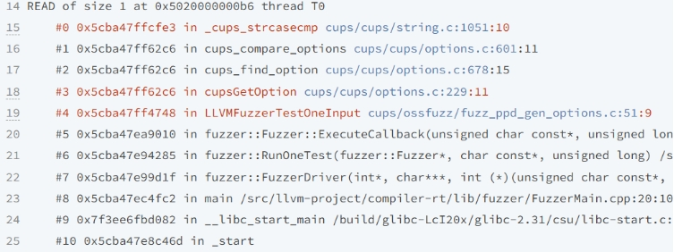
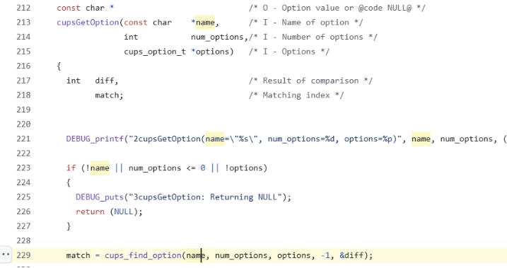
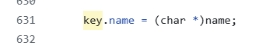
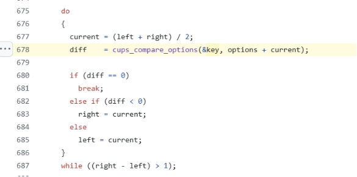
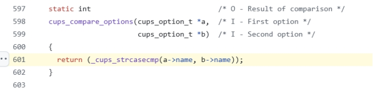
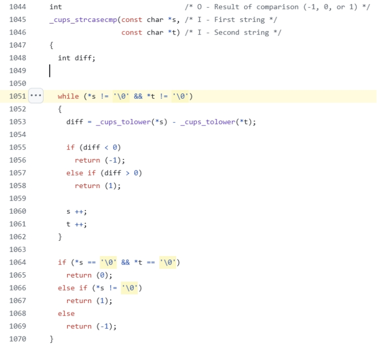
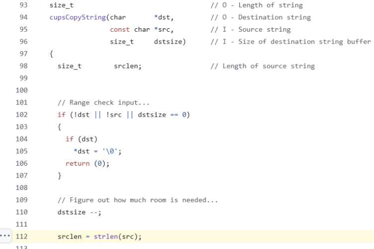
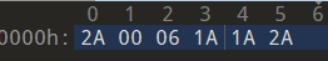
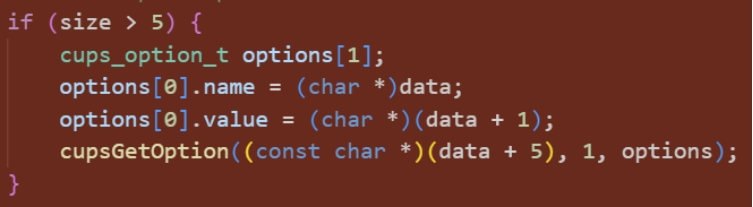

# Issues Analysis

## **heap-buffer-overflow issues in _cup_strcasecmp()**

https://issues.oss-fuzz.com/issues/425145247

https://issues.oss-fuzz.com/issues/425406125

https://issues.oss-fuzz.com/issues/425418727

stack trace:

 

 

cups_find_option:

 

 

 

 

string.c :

crash in _cups_strcasecmp

If s and t does not end in ‘\0’, it will be read out of bounds.

 

the same as crash in cupsCopyString:

 

 

 

crash case: 

fuzzer:

In actual operation, this problem should not occur, so I believe it is due to false positives caused by the quality of the fuzzer generated by the large model. Of course, the code can also be modified to enhance its robustness (I don't know if it is necessary, because normally target functions will not pass in illegal strings).